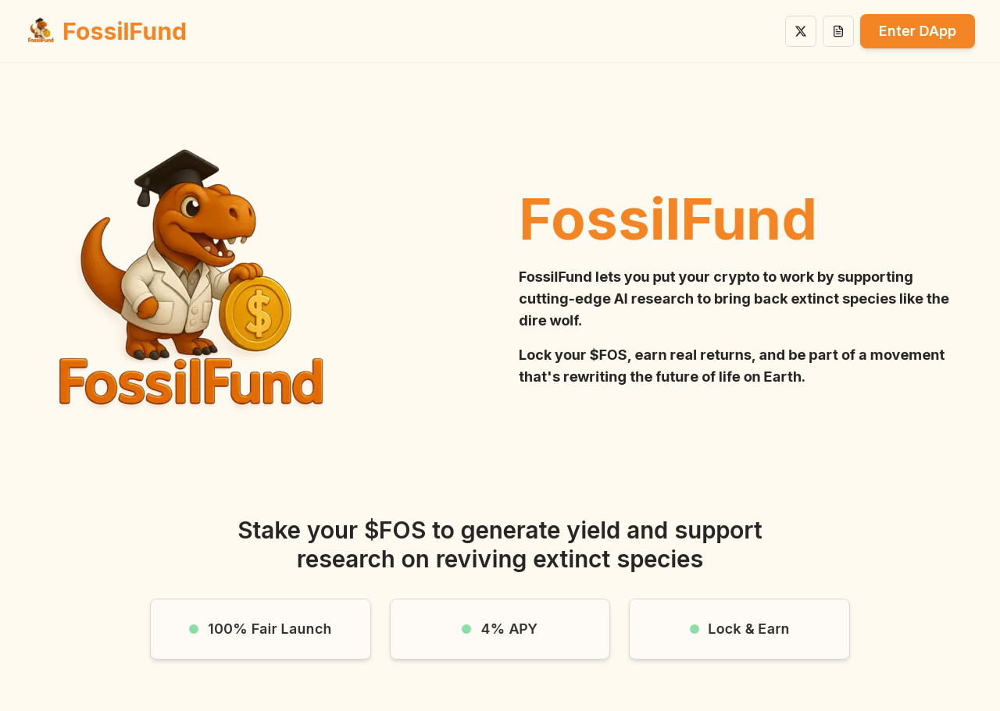

# FossilFund: Bringing Back Extinct Life, One Block at a Time

$FOS Meme Token Smart Contract: https://github.com/FossilFund/FossilFundFOSMemeToken/blob/main/%24FOSToken

FossilFund AI Agent Fund Manager Repo: https://github.com/mmmnaufal19/fossilfund-agent
## Project Description

FossilFund is a DeSci (Decentralised Science) meme token built on the **SUI network** that allows you to participate in research aimed at de-extincting species. Inspired by the potential resurrection of the dire wolf, FossilFund provides a unique way to put your crypto to work and directly contribute to scientific breakthroughs with the help of AI Agents, which could bring back lost life on Earth.

By locking your `$FOS` tokens, you not only earn real returns but also become an active part of a movement that is rewriting the future of biodiversity. The project is managed by advanced AI, ensuring efficient allocation of resources towards promising research initiatives.

Your crypto isn't just an investment; it's fuel for the return of lost species.

   

## Features

- **DeSci Focus:** Directly supports real-world research in de-extinction.
- **Stake to Earn:** Lock your `$FOS` tokens to earn rewards.
- **AI-Managed:** Leverages advanced AI for project management and resource allocation.
- **SUI Network:** Built on the efficient and scalable SUI blockchain.
- **Community-Driven:** Join a community passionate about science and conservation.
- **Transparent:** All transactions and research funding are transparent on the SUI blockchain.

## How to Get Started

1.  **Obtain $FOS Tokens:** Acquire `$FOS` tokens through supported decentralised exchanges on the SUI network. (Further details on specific exchanges will be provided soon).
2.  **Connect Your Wallet:** Connect your SUI-compatible wallet to the FossilFund platform.
3.  **Stake Your $FOS:** Navigate to the staking section of the platform and lock your desired amount of `$FOS` tokens.
4.  **Earn Rewards:** Start earning rewards in `$FOS` based on your staked amount and the platform's performance.
5.  **Support Research:** Your staked tokens contribute to the funding of de-extinction research projects.

## Contributing

We welcome contributions from the community! If you are interested in contributing to FossilFund, whether through development, research partnerships, community building, or other areas, please reach out through our official channels (links will be provided soon).

Specific ways to contribute include:

- **Code Contributions:** Help improve the FossilFund smart contracts, dApp, or AI models.
- **Research Partnerships:** Connect us with relevant de-extinction research projects or institutions.
- **Community Engagement:** Help grow and manage the FossilFund community.
- **Documentation:** Improve and expand our project documentation.

Please follow our contribution guidelines (to be provided) when submitting pull requests or engaging in community discussions.

## License

This project is licensed under the [Insert License Type, e.g., MIT License] - see the [LICENSE](LICENSE) file for details. (A LICENSE file will be added if applicable).

## Acknowledgements

- The SUI network provides a robust blockchain platform.
- The researchers and scientists are dedicated to advancing de-extinction technology.
- The FossilFund community for their support and belief in our mission.

---

*Note: This is a nascent project, and details regarding token acquisition, platform access, and specific research projects will be announced through official channels. Stay tuned for updates!*
